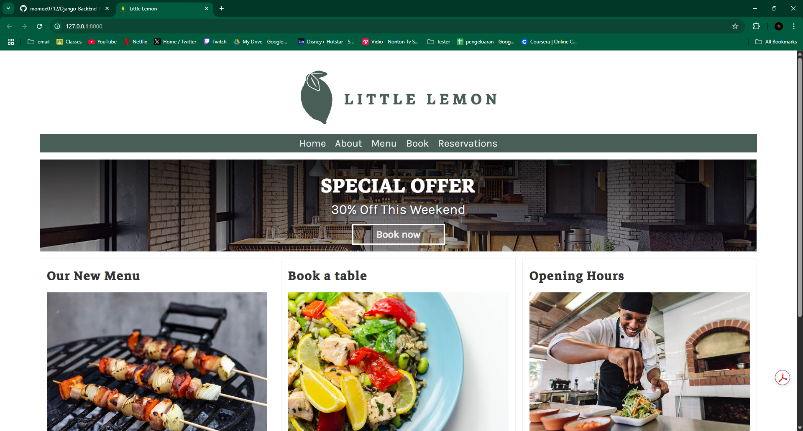
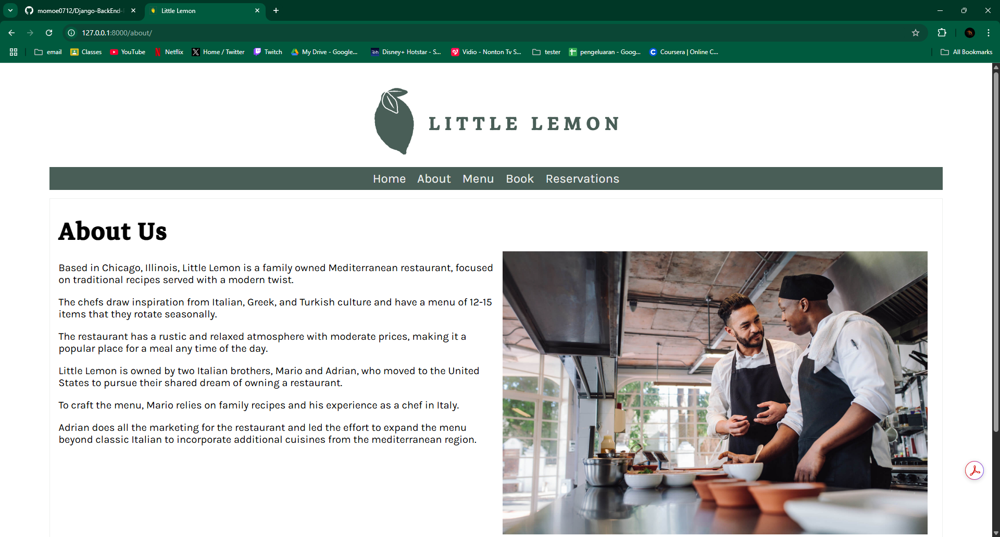

# Django BackEnd Project

This repository contains a Django-based backend application from [Meta Back-End Developer Professional Certificate](https://www.coursera.org/professional-certificates/meta-back-end-developer). It provides APIs and backend functionality for a restaurant-related service (e.g., menu management, reservations, etc.).

## 📂 Project Structure

```
├── littlelemon/
├── restaurant/
├── db.sqlite3
├── manage.py
├── Pipfile
├── Pipfile.lock
└── requirements.txt
```

## 🚀 Features

- Django backend with modular apps
- RESTful API endpoints
- SQLite database
- Easy environment management

## 🛠️ Installation

1. Clone the repository

```bash
git clone https://github.com/momoe0712/Django-BackEnd-Project.git
cd Django-BackEnd-Project
```

2. Create a virtual environment

Using Pipenv:

```bash
pipenv install
pipenv shell
```

Or using venv + pip:

```bash
python -m venv venv
source venv/bin/activate
pip install -r requirements.txt
```

3. Apply migrations

```bash
python manage.py migrate
```

4. Create a superuser

```bash
python manage.py createsuperuser
```

5. Run the server

```bash
python manage.py runserver
```

## Result 
### Home Page
<p align="left">
	
</p>

### About Page
<p align="left">
	
</p>

## ✨ Acknowledgements

- [Meta Back-End Developer Professional Certificate](https://www.coursera.org/professional-certificates/meta-back-end-developer)
- [Django Docs](https://docs.djangoproject.com/)
- [Python Docs](https://docs.python.org/)

